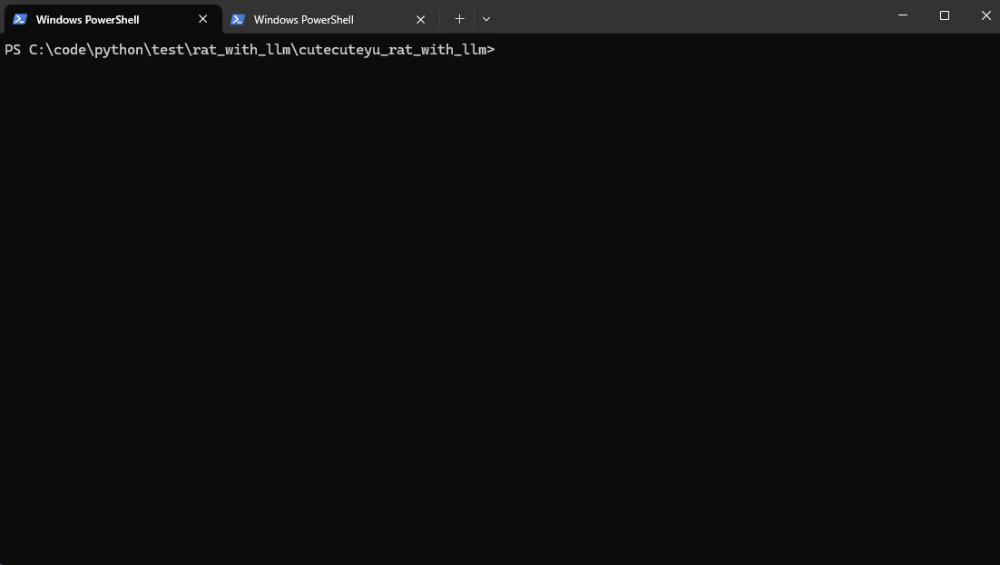

# CuteCuteyu-RAT - TCP远程命令执行系统

一个功能丰富的TCP远程命令执行系统，集成了LLM智能命令生成和高级终端交互功能。



## 功能特性

### 核心功能

- **TCP协议通信**：支持多客户端并发连接
- **远程命令执行**：服务端可向客户端发送任意系统命令
- **实时结果反馈**：客户端通过subprocess执行命令并返回完整结果
- **JSON消息传输**：标准化的消息格式，支持复杂数据交换
- **多线程处理**：支持并发连接和命令执行

### 高级特性

- **智能LLM集成**：集成DeepSeek AI，支持自然语言生成PowerShell代码
- **交互式终端**：类Metasploit风格的命令行界面
- **Tab键自动补全**：支持命令和参数的智能补全
- **会话管理**：支持多个会话的创建、切换和管理
- **监听器管理**：支持多个监听器的启动、停止和状态监控
- **跨平台支持**：支持Windows、Linux、macOS系统

### 安全特性

- **连接状态监控**：实时监控会话连接状态
- **资源自动清理**：程序退出时自动清理所有资源
- **错误处理机制**：完善的异常处理和错误恢复

## 项目结构

```
rat_with_llm/
├── .gitignore
├── .python-version
├── LICENSE
├── README-zh-cn.md
├── README.md
├── client/
│   └── client.py        # TCP客户端实现
├── command-zh-cn.md
├── command.md
├── fileserver/
│   └── escalation/      # 特权提升文件
│       ├── README.md
│       ├── client.exe
│       ├── compile_dll.bat
│       ├── compile_test.bat
│       ├── main.cpp
│       ├── privilege_escalation.dll
│       ├── test_dll.cpp
│       └── test_dll.exe
├── llm_info.py          # LLM API配置
├── main.py              # 主程序入口（服务端）
├── mytest.gif
├── ps.py                # PowerShell代码生成
├── pyproject.toml       # 项目配置和依赖
├── session.py           # 会话管理类
├── tab_completer.py     # Tab键自动补全
├── terminal.py          # 终端交互主类
├── uv.lock              # uv依赖锁文件
└── webserver.py         # Web服务器功能
```

## 安装和运行

### 前置要求

- Python 3.8+
- uv包管理器（推荐）或pip
- 网络连接（用于LLM功能）

### 使用uv运行（推荐）

1. **安装项目依赖**：

   ```bash
   uv sync
   ```
2. **配置LLM API**（可选，用于AI命令生成）：
   编辑 `llm_info.py` 文件，设置你的DeepSeek API密钥：

   ```python
   api_key = "your_deepseek_api_key_here"
   base_url = "https://api.deepseek.com"
   ```
3. **启动服务端**：

   ```bash
   uv run server
   ```

   或

   ```bash
   uv run python main.py
   ```
4. **启动客户端**：

   ```bash
   uv run client
   ```

   或指定服务器地址和端口：

   ```bash
   uv run python client.py <host> <port>
   ```

### 使用pip运行

1. **安装依赖**：

   ```bash
   pip install -r requirements.txt
   ```
2. **运行程序**：

   ```bash
   python main.py          # 启动服务端
   python client.py        # 启动客户端
   ```

## 使用说明

### 服务端操作（终端模式）

服务端启动后进入交互式终端界面，支持两种操作模式：

#### 主界面模式 (rat>)

- **管理监听器**：启动、停止和查看监听器状态
- **会话管理**：查看、进入和管理客户端会话
- **系统操作**：查看帮助、退出程序

#### 会话模式 (session X>)

- **命令执行**：在目标系统上执行任意命令
- **AI命令生成**：使用自然语言生成PowerShell代码
- **会话控制**：返回主界面或退出会话

### 客户端操作

客户端启动后自动连接到服务端，并等待接收命令：

1. **连接建立**：自动连接到指定服务器
2. **命令接收**：接收服务端发送的命令
3. **命令执行**：通过subprocess执行系统命令
4. **结果返回**：将执行结果返回给服务端
5. **状态监控**：实时显示连接和命令执行状态

### 基本使用流程

1. **启动服务端**

   ```bash
   uv run server
   ```
2. **启动监听器**（在服务端终端）

   ```bash
   rat> listen 0.0.0.0 8888
   ```
3. **启动客户端**

   ```bash
   uv run client
   ```
4. **查看会话**（在服务端终端）

   ```bash
   rat> sessions
   ```
5. **进入会话**

   ```bash
   rat> session 1
   ```
6. **执行命令**

   ```bash
   session 1> whoami
   ```
7. **使用AI功能**

   ```bash
   session 1> ai 获取系统信息
   ```
8. **返回主界面**

   ```bash
   session 1> background
   ```

### Web服务器管理

系统内置Web服务器功能，用于提供文件下载服务，特别适用于特权提升操作：

1. **启动Web服务器**

   ```bash
   rat> webserver
   ```

   - 默认端口：8000
   - 默认目录：`fileserver/`
   - 自动分配Web服务器ID
2. **查看运行的Web服务器**

   ```bash
   rat> webservers
   ```

   - 显示所有正在运行的Web服务器
   - 包含ID、端口和服务目录信息
3. **停止Web服务器**

   ```bash
   rat> webserver -k 1
   ```

   - 停止指定ID的Web服务器
   - 支持Tab键自动补全Web服务器ID
4. **Web服务器用途**

   - 为客户端提供文件下载服务
   - 支持特权提升文件分发
   - 支持自定义目录和端口

### 提权流程

系统支持特权提升功能，通过 `getsystem`命令实现：

1. **启动文件服务器**

   ```bash
   uv run main.py
   ```

   这将启动一个HTTP文件服务器，提供特权提升所需的文件下载。
2. **以管理员身份运行客户端**
   以管理员权限运行客户端程序：

   ```bash
   uv run client.py
   ```
3. **执行提权命令**
   在会话交互界面中输入 `getsystem`命令：

   ```bash
   session 1> getsystem
   ```
4. **自动提权过程**

   - 客户端会自动从文件服务器下载特权提升文件
   - 下载完成后自动执行提权程序
   - 提权完成后客户端会自动断开连接

**注意**：提权功能需要管理员权限运行客户端，且文件服务器必须正常运行。

## 配置选项

### 默认配置

- **服务器地址**：`localhost`
- **服务器端口**：`8888`
- **监听地址**：`localhost`（可配置为 `0.0.0.0` 监听所有接口）
- **连接超时**：5秒
- **缓冲区大小**：4096字节

### 自定义配置

可以通过以下方式自定义配置：

1. **命令行参数**：

   ```bash
   # 客户端指定服务器地址和端口
   uv run python client.py 192.168.1.100 9999
   ```
2. **修改代码默认值**：

   ```python
   # 在client.py中修改默认配置
   client = TCPClient('192.168.1.100', 9999)
   ```
3. **监听器配置**：

   ```bash
   # 在服务端终端中启动自定义监听器
   rat> listen 0.0.0.0 9999
   ```

### LLM配置

如需使用AI命令生成功能，需要配置DeepSeek API：

1. **获取API密钥**：访问 [DeepSeek官网](https://platform.deepseek.com/) 获取API密钥
2. **配置API信息**：编辑 `llm_info.py` 文件：
   ```python
   api_key = "your_actual_api_key_here"
   base_url = "https://api.deepseek.com"
   ```

## 安全注意事项

⚠️ **重要安全警告**：

### 安全风险

1. **远程命令执行**：此系统允许远程执行任意系统命令，存在严重安全风险
2. **网络暴露**：监听器可能暴露系统给未授权访问
3. **数据泄露**：传输的命令和结果可能被截获

### 使用建议

1. **网络环境**：仅在受信任的隔离网络环境中使用
2. **访问控制**：使用防火墙限制访问来源IP
3. **加密通信**：建议在VPN或加密隧道中使用
4. **权限最小化**：以最小必要权限运行客户端
5. **监控审计**：记录所有命令执行和网络活动

### 生产环境警告

- ❌ **禁止在生产环境使用**
- ❌ **禁止在公共网络使用**
- ❌ **禁止处理敏感数据**
- ✅ **仅用于教育、测试和授权渗透测试**

## 技术实现

### 核心架构

- **通信协议**：TCP Socket，支持可靠的双向通信
- **消息格式**：JSON标准化格式，支持复杂数据结构
- **命令执行**：subprocess.Popen，支持跨平台命令执行
- **并发处理**：threading多线程，支持并发连接和命令处理
- **编码标准**：UTF-8编码，支持多语言字符

### 高级功能实现

- **终端交互**：readline/pyreadline3实现类Metasploit风格界面
- **自动补全**：动态Tab键补全，支持命令和参数智能提示
- **会话管理**：Session类封装连接状态和通信逻辑
- **LLM集成**：OpenAI SDK集成，支持自然语言到代码转换
- **错误处理**：完善的异常捕获和错误恢复机制

### 性能优化

- **非阻塞I/O**：socket超时设置，避免线程阻塞
- **资源管理**：自动清理临时文件和连接资源
- **内存优化**：合理使用缓冲区大小和消息分块

## 依赖

### 核心依赖

- **Python 3.8+**：基础运行环境
- **openai>=2.2.0**：LLM API集成
- **pyreadline3>=3.4.1**：Windows系统Tab键补全支持

### 可选依赖

- **uv**：推荐的包管理器和运行环境
- **pytest**：开发测试框架

### 系统要求

- **Windows**：支持Windows 7及以上版本
- **Linux**：支持主流Linux发行版
- **macOS**：支持macOS 10.14及以上版本

## 许可证

MIT License

```
Copyright (c) 2025 CuteCuteyu

Permission is hereby granted, free of charge, to any person obtaining a copy
of this software and associated documentation files (the "Software"), to deal
in the Software without restriction, including without limitation the rights
to use, copy, modify, merge, publish, distribute, sublicense, and/or sell
copies of the Software, and to permit persons to whom the Software is
furnished to do so, subject to the following conditions:

The above copyright notice and this permission notice shall be included in all
copies or substantial portions of the Software.

THE SOFTWARE IS PROVIDED "AS IS", WITHOUT WARRANTY OF ANY KIND, EXPRESS OR
IMPLIED, INCLUDING BUT NOT LIMITED TO THE WARRANTIES OF MERCHANTABILITY,
FITNESS FOR A PARTICULAR PURPOSE AND NONINFRINGEMENT. IN NO EVENT SHALL THE
AUTHORS OR COPYRIGHT HOLDERS BE LIABLE FOR ANY CLAIM, DAMAGES OR OTHER
LIABILITY, WHETHER IN AN ACTION OF CONTRACT, TORT OR OTHERWISE, ARISING FROM,
OUT OF OR IN CONNECTION WITH THE SOFTWARE OR THE USE OR OTHER DEALINGS IN THE
SOFTWARE.
```

## 贡献指南

欢迎提交Issue和Pull Request来改进项目。

### 开发规范

- 遵循PEP 8代码风格
- 添加适当的注释和文档
- 确保向后兼容性
- 包含单元测试

### 问题反馈

- 使用GitHub Issues报告bug
- 提供详细的复现步骤
- 包含系统环境和版本信息

---

*如需详细命令使用和高级功能说明，请参考[命令文档](command-zh-cn.md)。*

---

*最后更新：2025年*
*CuteCuteyu*
